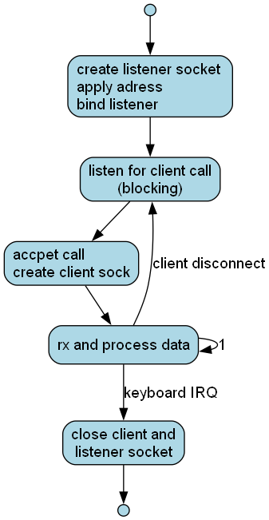

# sockReceiverCpp

An excercise in Cpp and socket programming

A TCP-server, that listens on clients and prints incoming messages to a console, providing a handy tool to observe packets sent from a TCP node.

### flow chart

DONE: fix wrong read-in of port number

TODO: validate correct input format of IP addresses

### uses google C++ test framework
* DONE parameterized port test cases
* TODO create dedicated test cpp file

### install gtest on a debian/raspberry
* according to https://stackoverflow.com/questions/13513905/how-to-set-up-googletest-as-a-shared-library-on-linux
* wget https://github.com/google/googletest/releases/download/v1.16.0/googletest-1.16.0.tar.gz
* tar xf googletest-1.16.0.tar.gz googletest-1.16.0/
* cd googletest-1.16.0/
* cmake -DBUILD_SHARED_LIBS=ON .
* make
* sudo make install
* sudo ldconfig -v | grep gtest
